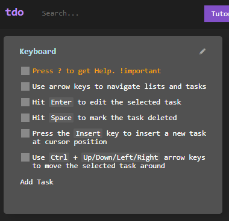

# tdo

A hackable TODO list suitable for handling many tasks, big or small.


|     |     |     |
| --- | --- | --- |
|  |  |  |  |

Tdo strives for minimalism and offers customizability to those who want it. Style it, optimize it, however it suits you. 

Features:

- task boards
- Markdown support
- search
- custom CSS for boards and lists
- regex based task highlighting
- Google Firebase based authentication and storage
- drag & drop
- keyboard based navigation
- automatic removal of completed items
- touch support
- offline mode

[Open](https://tdo.cxjs.io),

[install](https://github.com/codaxy/tdo/releases/tag/1.0.0) it for Windows,

Or get it for android by visiting it through Chrome and click 'add to your homescreen'.


## Install & Run

Install:
```
yarn
```    
Run:
```
yarn start    
```

If you don't use yarn yet, npm will do too.

## Usage

On the homepage you will be presented with two card, *Blank page* and *Tutorial*. For the first time it's best you select the tutorial one which will open a preset tutorial board, explaining all the basic functions of Tdo! In the upper portion of the page, *Help ?* will provide you with instructions on additional functionality.


## Contributing

If you would like to contribute, which we would appreciate very much, you can!
1. Just fork this repository
2. Clone it to your local machine using https://github.com/codaxy/tdo.git
3. Hack Away and create a new pull request!


## FAQ

- How do I know which element is which in CSS?
    - Sorry, but for now you will have to use inspect page, it is a hackable to-do list afterall, isn't it?

- Is there a way i can save my tasks?
    - Yes! You can register in the upper part by clicking [SignIn](https://tdo.cxjs.io/signIn). It will also save your CSS code.


**Built using [CxJS](https://cxjs.io)**

